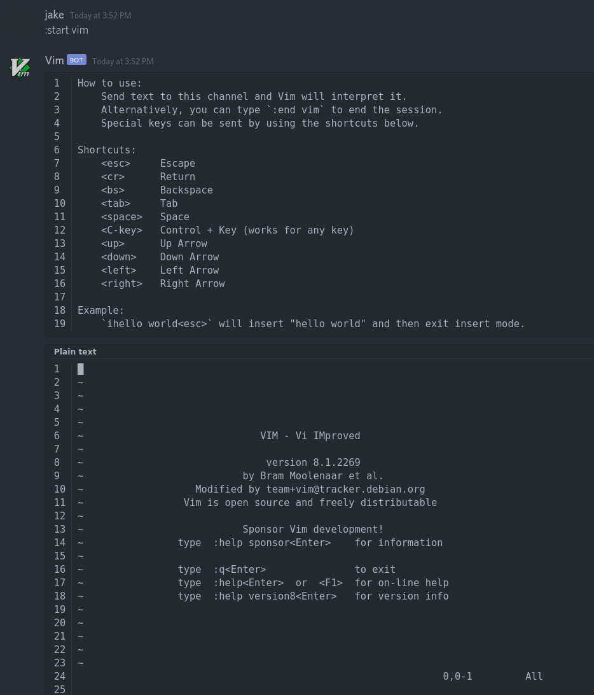

# discord-vimbot
Runs vim over discord by using a tmux session sudoed into a restricted user.

I don't recommend using this unless you know what you're doing or want your computer hacked.

## Requirements
`discord.py`, `tmux`, and `python3`
